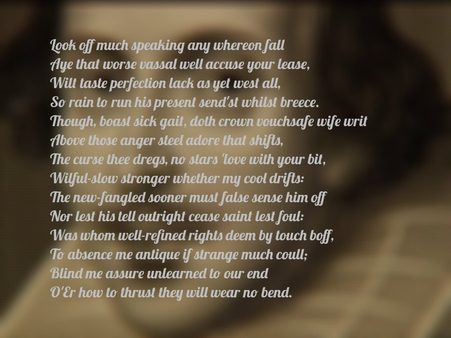

# Will A.I. Shakespeare
Will A.I. Shakespeare is a procedural Shakespearean sonnet generator written in 36 hours at the 2017 Utah State University Hackathon. It utilizes the capabilites of the Natural Language Toolkit to write poetry following the strict meter and rhyme-scheme requirements of Shakespeare's sonnets. It relies on Shakespeare's sonnets themselves to provide vocabulary and aide in the random generation of grammatical structures. 

It took first place in the Hackathon's "General" category and also scored the greatest number of points overall.

We also threw in a script that does this:
<kbd>

</kbd>

# Installation

Requires Python 2.7 and associated pip

```
sudo pip install nltk pronouncing 
python download_reqs.py
```

# Usage

To generate a new sonnet:
```
python shakespeare.py
```

To generate a new sonnet and save to a .jpg superimposed over blurry Shakespeare:
```
./generate.sh
```
